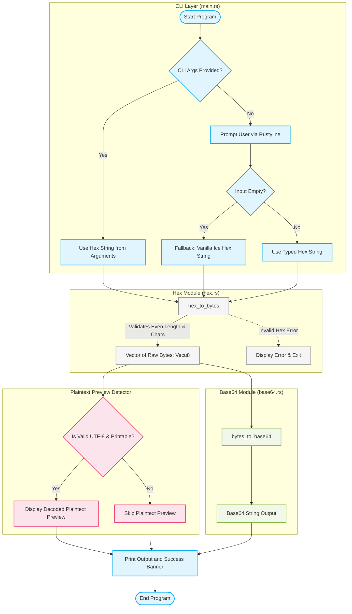

# System Architecture Diagram

This document presents the architectural layout and execution data flow of the `cryptopals` hex-to-base64 conversion utility.

---

## 1. Project Crate Architecture
Our workspace is laid out as a modular Rust crate. The interactive binary driver ([src/main.rs](file:///home/hasrat/Documents/CryptoPals_Challenges/src/main.rs)) depends on our core library ([src/lib.rs](file:///home/hasrat/Documents/CryptoPals_Challenges/src/lib.rs)), which cleanly exports standalone encoding modules.

```mermaid
graph TD
    subgraph Binary Crate
        Main[src/main.rs <br/> CLI Driver]
    end

    subgraph Library Crate (cryptopals)
        Lib[src/lib.rs <br/> Crate Root]
        HexMod[src/hex.rs <br/> Hex Encoder/Decoder]
        B64Mod[src/base64.rs <br/> Base64 Encoder/Decoder]
    end

    %% Dependency Links %%
    Main -->|Imports| Lib
    Lib -->|Exposes| HexMod
    Lib -->|Exposes| B64Mod
```

---

## 2. Execution & Data Flow Diagram
This flowchart tracks the conversion pipeline, showing how input is processed step-by-step, how it respects the **Cryptopals Rule** (operating entirely on raw bytes in transit), and how printable plaintext is automatically detected for terminal display.



---

## 3. Key Architectural Principles

1. **The Cryptopals Rule (Strict Encapsulation)**:
   The library never performs "string-to-string" conversions directly. Hex is parsed down to raw byte arrays (`Vec<u8>`), which serve as the universal data currency. The Base64 module only serializes raw bytes back to string format.
2. **Zero External Cryptographic Dependencies**:
   Both encoding and decoding algorithms are written purely in native safe Rust code to maintain full control over the execution mechanics.
3. **Robust Separation of Concerns**:
   - `hex.rs` is solely concerned with Base16 serializations.
   - `base64.rs` is solely concerned with Base64 serializations.
   - `main.rs` manages user experience, CLI interfaces, and terminal decoration.
